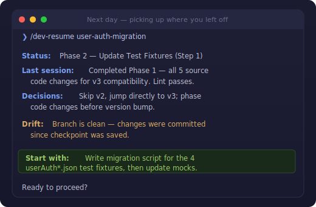
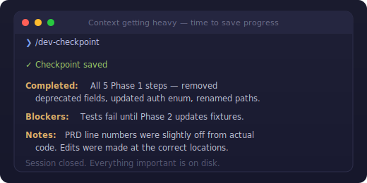
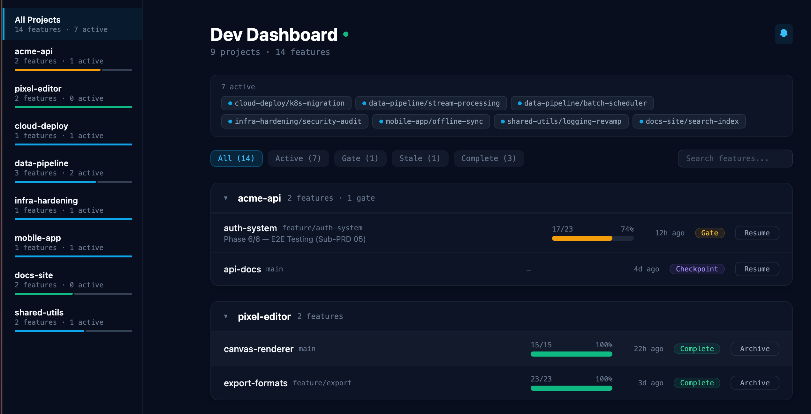

<div align="center">

# dev-workflow

[](LICENSE)
[](.claude-plugin/marketplace.json)
[](https://agentskills.io)

**Claude forgets everything between sessions. This fixes that.**

Context fills up. You restart. Twenty minutes re-explaining what you were building, what you decided, where you left off. Or:

`/dev-resume`



</div>

---

**Three commands. That's it.** `/dev-plan` once to create a plan. `/dev-checkpoint` when you stop. `/dev-resume` when you come back. Everything comes back — decisions, progress, blockers, the exact next step. Try it once.

---

## The Problem

LLM performance degrades as context fills up. This isn't a theoretical concern — after ~200K tokens of accumulated conversation, tool outputs, and debugging tangents, responses get slower, details get missed, and earlier decisions get contradicted. Even with 1M context windows, **more context means worse output**.

Every developer using AI coding agents hits the same wall:

- **Session 1:** Great output. Claude is sharp, follows the plan, remembers everything.
- **Session 1 (continued):** Context filling up. Responses slower. Starts forgetting things you discussed 30 minutes ago.
- **Session 2:** Fresh start. But now you're the one who has to remember everything and re-explain it. Poorly.

The common workaround? Manually copy plans into files, paste fragments back into new sessions, hope you didn't forget anything important. It works. It's also tedious, error-prone, and doesn't scale past one feature.

**dev-workflow automates this.** It saves structured progress to disk — not conversation dumps, but the specific state needed to resume: what's done, what's next, what was decided, and what to watch out for. Each new session starts clean with minimal context and full continuity.

---

## How It Works

```
  Plan          Build         Checkpoint      New Session     Resume
  ─────         ─────         ──────────      ───────────     ──────
  /dev-plan  →  implement  →  /dev-checkpoint  →  restart  →  /dev-resume
                                                                  │
                                                                  ▼
                                                            build again...
```

| Step | What you do | What happens |
|------|-------------|--------------|
| **1. Plan** | `/dev-plan` | Generates a structured PRD in `.dev/` with phases and gates |
| **2. Build** | Implement | Work until context gets heavy |
| **3. Checkpoint** | `/dev-checkpoint` | Saves progress, git state, decisions, next steps |
| **4. Restart** | Close and reopen Claude | Fresh context window, clean slate |
| **5. Resume** | `/dev-resume` | Loads ~2KB checkpoint, rebuilds context, picks up where you left off |

**Repeat steps 2–5** until the feature is complete. Each session starts fresh with high-quality context.

---

## Installation

### Claude Code (Plugin)

```
/plugin marketplace add andreaserradev-gbj/dev-workflow
/plugin install dev-workflow
```

<details>
<summary>Updating & Troubleshooting</summary>

```
/plugin marketplace update dev-workflow
```

If the plugin doesn't load after updating, clear the cache and reinstall:

```bash
rm -rf ~/.claude/plugins/cache/dev-workflow
rm -rf ~/.claude/plugins/marketplaces/dev-workflow
```

Then re-run the install commands above.

</details>

### Codex

Tell Codex:

> Clone `https://github.com/andreaserradev-gbj/dev-workflow.git` and follow `.codex/INSTALL.md` from the local checkout.

Or see [docs/README.codex.md](docs/README.codex.md) for manual setup.

### Gemini CLI

```bash
gemini skills install https://github.com/andreaserradev-gbj/dev-workflow.git --path plugins/dev-workflow/skills
```

Or see [docs/README.gemini.md](docs/README.gemini.md) for alternatives.

---

## Skills

### `/dev-plan` — Plan a feature

Creates a structured PRD with phases, status markers, and gates. Three phases:

1. **Understand** — gather requirements (or infer from inline arguments)
2. **Research** — explore the codebase using parallel agents
3. **Write** — produce `.dev/<feature-name>/00-master-plan.md`

```
/dev-plan add OAuth login with Google and GitHub providers
/dev-plan refactor the database layer to use connection pooling
```

### `/dev-checkpoint` — Save progress



Captures everything needed to resume later:

- Updates PRD status markers (`⬜` → `✅`)
- Captures git state (branch, last commit, uncommitted changes)
- Records decisions, blockers, and next steps
- Writes `.dev/<feature-name>/checkpoint.md`

```
/dev-checkpoint
/dev-checkpoint oauth-login
```

### `/dev-resume` — Pick up where you left off

Reconstructs context from a checkpoint:

- Loads the checkpoint and verifies state (branch, staleness, drift)
- Builds a focused summary with a concrete "Start with" action
- Enforces phase gates — won't skip ahead without your approval

```
/dev-resume
/dev-resume oauth-login
```

### `/dev-wrapup` — Extract session learnings

Reviews the conversation for insights worth keeping:

- Scans for corrections, conventions, and project quirks
- Routes findings to the right place (project docs, scoped rules, user memory)
- Applies nothing without explicit confirmation
- Learns your preferences over time via `.dev/wrapup-feedback.json`

```
/dev-wrapup
```

### `/dev-status` — See all features at a glance

Scans `.dev/` with parallel agents and generates a status report:

- Progress and status counts across all features
- Offers to archive completed or stale features to `.dev-archive/`

```
/dev-status
```

### `/dev-board` — Project dashboard

Generates a visual dashboard from `.dev/` data:

- **HTML board** (`.dev/board.html`) — feature cards with progress bars
- **Stakeholder summary** (`.dev/board-stakeholder.md`) — markdown for sharing

```
/dev-board
```

### `/dev-dashboard` — Live cross-project view



A local web server that scans `.dev/` folders across all your projects and shows live feature status in the browser. Real-time updates via WebSocket — edit a PRD and the dashboard reflects changes instantly.

```
/dev-dashboard
```

Starts the server (or reuses an existing instance) and displays the URL. No setup required — the server is bundled with the plugin.

<details>
<summary>Configuration</summary>

Config lives at `~/.config/dev-dashboard/config.json` (created automatically on first run):

```json
{
  "scanDirs": ["~/code"],
  "port": 3141
}
```

| Field | Type | Default | Description |
|-------|------|---------|-------------|
| `scanDirs` | `string[]` | `["~/code"]` | Directories to scan for projects containing `.dev/` folders |
| `port` | `number` | `3141` | HTTP server port |

See [tools/dev-dashboard/README.md](tools/dev-dashboard/README.md) for CLI flags and more details.

</details>

<details>
<summary>Running from the terminal</summary>

You can start and stop the dashboard outside of Claude Code by adding these to your shell config:

```bash
dev-dashboard() {
  local result
  result=$(bash ~/.claude/plugins/marketplaces/dev-workflow/plugins/dev-workflow/skills/dev-dashboard/scripts/start.sh)
  echo "$result"
  local port="${result#*:}"
  if [[ "$result" == running:* || "$result" == started:* ]]; then
    open "http://localhost:${port}"
  fi
}

dev-dashboard-stop() {
  local pids
  pids=$(pgrep -f 'dev-dashboard/dashboard/server/index.cjs')
  if [[ -z "$pids" ]]; then
    echo "No dev-dashboard server running"
    return 0
  fi
  echo "$pids" | xargs kill
  echo "Stopped dev-dashboard (pid: ${pids//$'\n'/, })"
}
```

Then run `dev-dashboard` to start and open the browser, and `dev-dashboard-stop` to shut it down.

</details>

---

## Design Principles

**Composable, not prescribed.** Each skill is independent. Use `/dev-plan` without `/dev-checkpoint`. Use `/dev-resume` alongside `/code-review`, Jira, Slack, or any other tool. Start a session without any plan at all. The skills work together but never force a sequence.

**Plans are living documents.** PRDs have status markers (`⬜` / `✅` / `⏭️`) and phase gates (`⏸️ GATE`). They're meant to be edited mid-flight — add phases, skip steps, rewrite sections when requirements change. Checkpoints capture the decisions behind those changes.

**Context quality over context quantity.** Checkpoints are structured compression — they preserve what matters (state, decisions, next actions) and deliberately discard what doesn't (debugging tangents, tool output, failed attempts). Each resumed session starts lean.

---

## Git Tracking

`.dev/` and `.dev-archive/` are tracked in git by default — PRDs, checkpoints, and archived features become part of your project history. To exclude them:

```
# .gitignore
.dev/
.dev-archive/
```

---

## Tips

- **Checkpoint before context fills up** — don't wait until you're forced to restart
- **Use `/dev-plan` for complex features** — for quick fixes, just work directly
- For large features, ask Claude to **break the PRD into sub-documents** during `/dev-plan`

## License

MIT
